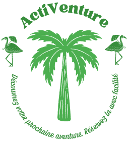
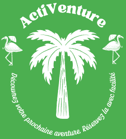

# tp Flutter

Dans ce projet j'ai réalisé l'application ActiVenture. 

Foncionnalités:
User stories demandées:
 - US 1: Page de connexion
 - US 2: Page d'accueil "Activités"
 - US 3: Détail d'une activité
 - US 4: Panier avec calcul du prix et possibilité de suprimer une activité du panier.
 - US 5: Page profile avec possibilité de modifier les information de l'utilisateur et boutton de déconnexion.
User Stories Supplémentaires: 
 - US 6: Filter les activités par catégories en recherchant les activités existantes dans la collection "Activites" sur Firestore.
 - US 7: Page d'inscription, dans ce tp j'ai réalisé une authentification complète, en utilisation Firebase Google Auth et une jointure avec la collection "users" sur firestore en utilisant l'id de l'utilisateur.

 Expérience utilisateur: 
  - Une fois ouvrir l'application : 
   - Première page : Login , si vous n'avez pas encore un compte cliquer sur "Créer un compte"
   - Page d'inscription: renseigner les information demandées puis cliquer sur "inscrire".
   - Une fois inscrit, revenez sur la page du Login pour se connecter.
   - Une fois connecté votre nom apparaitera dans la page d'accueil de l'application.
   - Vous trouverez une liste d'activités, en cliquant sur chacune, vous pouvez voir son détail et l'ajouter sur le panier.
   - en cliquant sur le panier, vous pouvez visualiser les activités que vous avez ajouter sur votre session utilisateurs et pouvoir supprimer des activités du paniern ansi que voir le prix total du panier. 
   - en cliquat sur "Profile", vous pouvez visualiser toutes vos informations que vous avez entrez lors de votre inscription et pouvoir les modifier, vous pouvez également déconnecter et dans ce cas vous serez redirigé vers la page du Login (fin de la session).

Interface utilisateurs: 
 - Charte graphique : la charte graphique contient principalement des nuances de vert qui correspont à la nature et souvent lié aux avenures qui représentent le thème de l'application. 
  - Couleurs de la charte : 
   1. Vert principal : Utilisé pour les titres et les éléments importants.
     - Couleur : #4CAF50
     - Valeur en Flutter : Colors.green[500]
   2. Vert foncé : Utilisé pour les icônes et les éléments de navigation.
     - Couleur : #388E3C
     - Valeur en Flutter : Colors.green[900]
   3. Blanc : Utilisé comme couleur de fond principal.
     - Couleur : #FFFFFF
     - Valeur en Flutter : Colors.white
   4. Vert clair : Utilisé comme couleur de fond secondaire.
     - Couleur : #E8F5E9
     - Valeur en Flutter : Colors.green[50]

 - Logo : 
   - Inspiration du design : Le design du Logo est un arbre entouré de deux oiseaux, l'arbre donne     rappel à la nature et les aventures et le oiseau stimule la liberté du choix et l'ouverture d'esprit. Au dessus, le nom de l'application "Activenture" et en bas notre slogon "Découvrez votre prochaine aventure, Réservez la avec facilité". 
   - Types de logos crées: J'ai créé deux modèles du logo, le principale sur un fond blanc et le secondaire en couleur blanche sur un le fond vert principale de l'application afin de l'utiliser sur la bare de menu de l'application. 

   
     

